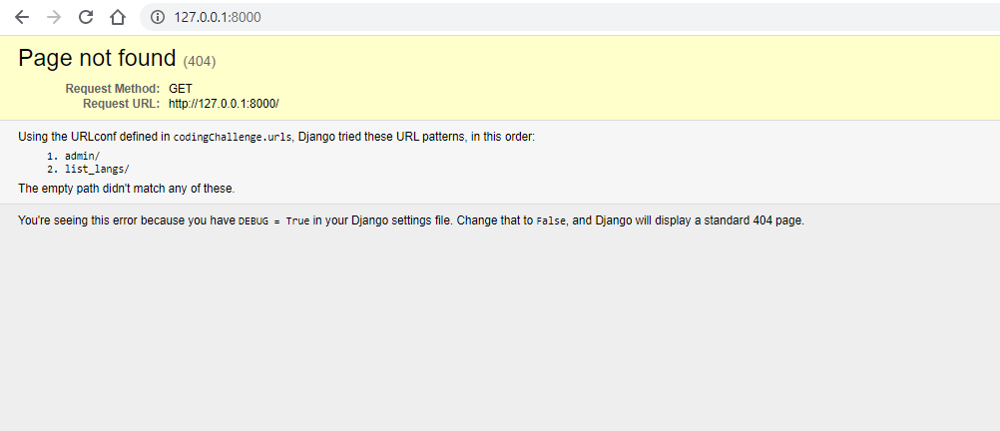
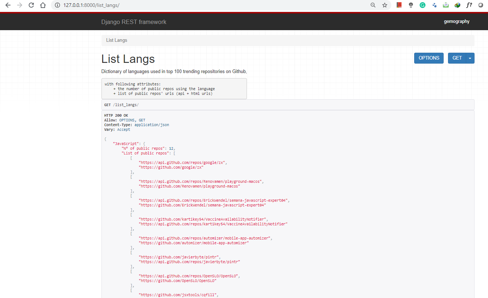

# Gemography Backend Dev Challenge

# Functional specs

Develop a REST microservice that list the languages used by the 100 trending public repos on GitHub.
For every language, you need to calculate the attributes below 👇:
  * Number of repos using this language
  * The list of repos using the language

# Technical specs

## Language

  * Python

## Framework 

  * Django 
  * Django Rest Framework

## How to 

Locally on your machine, download the zipped project or clone it then:

  + cd to the project directory
  + start the server using __`python manage.py runserver`__
  + Then go to http://127.0.0.1:8000/list_langs/

## Screenshots

